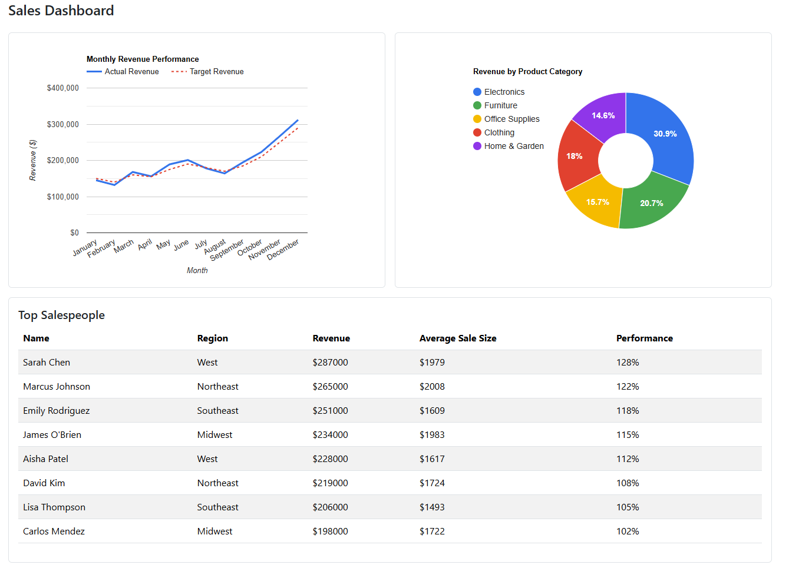
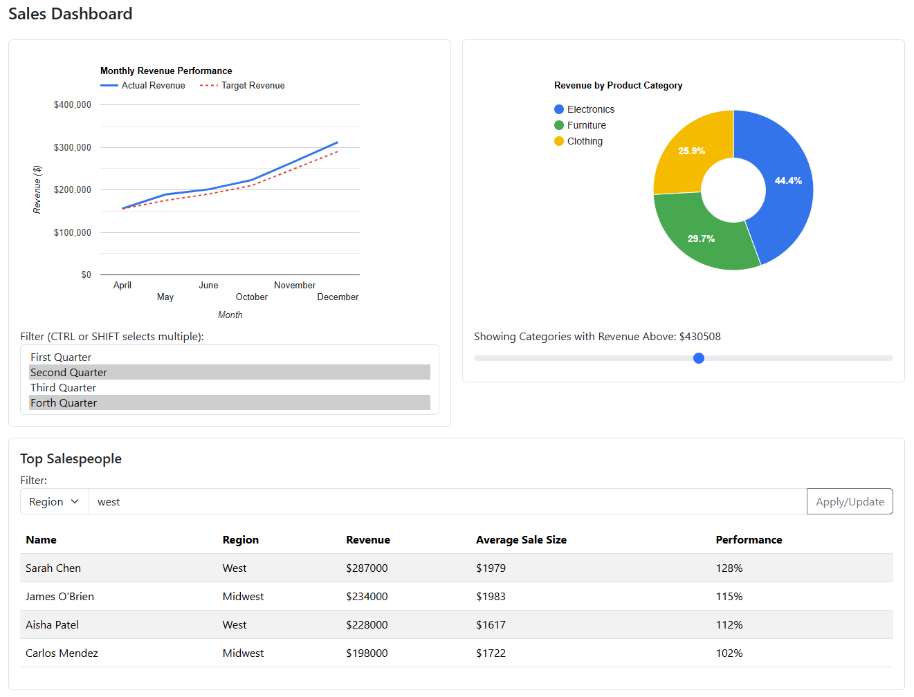

[](https://classroom.github.com/a/2Z5mxp05)
## Introduction

In this assignment, you will be using JavaScript and some sample data to create a sales dashboard for a company that consists of a line chart, a pie chart, and a table display.  You will also be using 3rd party libraries for styling and charting libraries to format your web application and render a chart.  You will also be using JavaScript to set events to filter data.

Work on the assignment is to be done ***individually***.  You are welcome to collaborate with class members, but the project must be your own work.

## Background and References

Recall that in JavaScript, an object can be defined literally:

```
let person = {
    name: "roscoe", 
    age: 21,
};
```

In this case, the person object has properties that can be accessed as person.name and person.age.

Also, recall that in JavaScript, an array can be defined literally:

```
let charList = ["a", "b", "c"];
```

In this case, the charList array elements can be accessed individually as ```charList[0]```, ```charList[1]```, etc.

Combining the two concepts, we can define a literal array of objects:

```
let people = [
  { name: "roscoe", age: 21},
  { name: "rhonda", age: 22},
];
```

We can access the first person's name as ```people[0].name```, etc.

You will be using a charting library for this assignment.  The following resources might be helpful:

- Google Charts Home Page: [https://developers.google.com/chart](https://developers.google.com/chart).
- Google Charts Line Chart Reference: [https://developers.google.com/chart/interactive/docs/gallery/linechart](https://developers.google.com/chart/interactive/docs/gallery/linechart)
- Google Charts Pie Chart Reference: [https://developers.google.com/chart/interactive/docs/gallery/piechart](https://developers.google.com/chart/interactive/docs/gallery/piechart).
- Google Charts Visualization Reference: [https://developers.google.com/chart/interactive/docs/reference](https://developers.google.com/chart/interactive/docs/reference).

You will also need to filter and manipulate arrays for this assignment.  The following references to JavaScript array manipulation might be useful:

- Mozilla Developer Network Reference on JavaScript Arrays: [https://developer.mozilla.org/en-US/docs/Web/JavaScript/Reference/Global_Objects/Array](https://developer.mozilla.org/en-US/docs/Web/JavaScript/Reference/Global_Objects/Array).
- Array.filter Reference: [https://developer.mozilla.org/en-US/docs/Web/JavaScript/Reference/Global_Objects/Array/filter](https://developer.mozilla.org/en-US/docs/Web/JavaScript/Reference/Global_Objects/Array/filter).
- Array.map Reference: [https://developer.mozilla.org/en-US/docs/Web/JavaScript/Reference/Global_Objects/Array/map](https://developer.mozilla.org/en-US/docs/Web/JavaScript/Reference/Global_Objects/Array/map)

## Project Description

For this assignment, you will create a web application that shows a sales dashboard using charts and a table.  The application will also include a user interface to allow the user to filter the data displayed in the charts and the table.

### Part 1: Displaying the Data

The data for the charts and table is given in a pre-defined JavaScript arrays of objects.  Each array object has entries that contain keyed data to be displayed in the charts and the table.

For example:

```javascript
const monthlySales = [
    { month: 'January', revenue: 145000, units: 1250, target: 150000 },
    { month: 'February', revenue: 132000, units: 1100, target: 140000 },
    { month: 'March', revenue: 168000, units: 1420, target: 160000 },
    { month: 'April', revenue: 156000, units: 1310, target: 155000 },
    { month: 'May', revenue: 189000, units: 1580, target: 175000 },
    { month: 'June', revenue: 201000, units: 1690, target: 190000 },
    { month: 'July', revenue: 178000, units: 1490, target: 180000 },
    { month: 'August', revenue: 164000, units: 1370, target: 170000 },
    { month: 'September', revenue: 195000, units: 1640, target: 185000 },
    { month: 'October', revenue: 223000, units: 1870, target: 210000 },
    { month: 'November', revenue: 267000, units: 2240, target: 250000 },
    { month: 'December', revenue: 312000, units: 2620, target: 290000 }
];

const productCategories = [
    {
        category: 'Electronics',
        revenue: 782000,
        units: 3200,
        margin: 0.28,
        growthRate: 15.2
    },
    {
        category: 'Furniture',
        revenue: 524000,
        units: 1800,
        margin: 0.35,
        growthRate: 8.7
    },
    // etc...
};

const topSalespeople = [
    {
        name: 'Sarah Chen',
        region: 'West',
        revenue: 287000,
        deals: 145,
        avgDealSize: 1979,
        performance: 128 // percentage of target
    },
    {
        name: 'Marcus Johnson',
        region: 'Northeast',
        revenue: 265000,
        deals: 132,
        avgDealSize: 2008,
        performance: 122
    },
    // etc.
};
```

You must create a line chart, a pie chart, and a table

#### Line Chart - Monthly Sales Data

The line chart must display the monthly sales revenue along with the monthly target (contained in the ```monthlySales``` variable).  

- The line chart must display two lines, one for the monthly revenue and one for the monthly target.
- When the user hovers or clicks on the line at the point of a particular month a tooltip should pop up showing the numerical value for that month.

***NOTE:*** There is additional data elements in the ```monthlySales``` variable that will not be used.

#### Pie Chart - Categories

The pie chart must display the categories with the value for each pie "wedge" representing the revenue for each category (contained in the ```productCategories``` variable)

- When the user hovers or clicks on a pie "wedge" a tooltip should pop up showing the numerical value for that category.
- The number for in each pie "wedge" should show the percentage of all revenue for the particular category

***NOTE:*** There is additional data elements in the ```productCategories``` variable that will not be used.

#### Table - Top Salespeople

The table should display information for the top salespeople at the company (contained in the ```topSalespeople``` variable).

The columns in the table should include:
- Name (string)
- Region (string)
- Revenue (dollar amount)
- Average Sale Size (dollar amount)
- Performance (percentage of target)

***NOTE:*** There is additional data elements in the ```topSalespeople``` variable that will not be used.

When displayed correctly, the charts and table might look like this:



***NOTE:*** This assignment requires the use of a table to display top salespeople.  You are free to use an HTML table, create one yourself using ```<div>``` elements or use a third party library provided the requirements for the table are met.<br/>If you are looking for a challenge consider using a [Google table chart](https://developers.google.com/chart/interactive/docs/gallery/table).

***NOTE:*** This assignment requires the use of a charting library to graph the data.  You've worked with Google charts in the past, but any charting library is allowed provided you follow the requirements for the charts.

### Part 2: Filtering the Data

Your web application must also allow the user to filter the displayed data based on values from different filter interfaces.

#### Filtering the Line Chart (Monthly Sales)

Allow the user to filter monthly sales (line chart) by quarters of the year.  Once a filter value is selected, the line chart should immediately update showing only the values for the selected quarters.

The months for each quarter of the year are as follows:

- First Quarter - January, February, and March
- Second Quarter - April, May, and June
- Third Quarter - July, August, and September
- Fourth Quarter - October, November, and December

The user must be allowed to select either a single quarter or multiple quarters.  For this consider using a multiple select: https://www.w3schools.com/tags/att_select_multiple.asp

If the user selects **NO** categories, then display **ALL** months.

***NOTE:*** The filter for monthly sales data should not affect the other charts/table.

#### Filtering the Pie Chart (Categories)

Allow the user to filter the categories (pie chart) by category revenue.  The user must be allowed to select a target number value for revenue and the pie chart should update to show only categories that exceed (greater than) that target revenue amount.  The percentages should be updated to show the percentage for the filtered categories.

For this filter, consider using a range slider: https://www.w3schools.com/howto/howto_js_rangeslider.asp

***NOTE:*** The filter for categories data should not affect the other charts/table.

#### Filtering the Table (top salespeople)

Allow the user to filter the top salespeople by two categories: Name and Region.  The user must be allowed to type a filter string and the table should update to show only the salespeople whose values contain the filter string.

This can be done with a ```select``` to select the category (name or region), a text input, and a button.  You are welcome to use other components provided the required functionality is implemented.

***NOTE:*** this filter should perform a ***case-sensitive***, ***substring*** match

If the user filters with an **EMPTY** string, then display **ALL** top salespeople

When the filters are working correctly, the charts and table might look like this:



### Part 3: Styling

The elements in your web application should be styled beyond the browser defaults.  Details on required styling are as follows.

#### Line Chart (Monthly Sales) Styling

- The line chart must have an appropriate title
- The line chart must have a legend with appropriate names for the lines
- The lines for the chart must be styled to something other than your library's default.  For Google charts, this is done via the ```options``` object.  The specifics of the styling are up to you.

#### Pie Chart (Category Sales) Styling

- The pie chart must have an appropriate title
- The pie chart must have a legend with appropriate names for the pie "wedges"
- The pie "wedges" must be styled with colors and font styled to something other than your library's default.  For Google charts, this is done via the ```options``` object.  The specifics of the styling are up to you.

#### Other Styling

- Use a styling library to format your buttons, table, text fields, etc.  You are welcome to use Bootstrap or another of your own choosing.
- Be creative with your styling.  Your web app does ***NOT*** need to look exactly like the figures.

Additional styling is not required, but is allowed.  If using additional styling, place your styles in a separate CSS file.

## Getting Started

Create a WebStorm project for this assignment.  In the project you will need the files included in the repository:

- [SalesDashboard.html](src/SalesDashboard.html) - Web page HTML file (includes the imports for Bootstrap, Google Charts, and the SalesDashboard JavaScript files)
- [SalesDashboard.js](src/SalesDashboard.js) - JavaScript source file containing your event handlers and manipulation of the DOM 
- [SalesDashboardData.js](src/SalesDashboardData.js) - JavaScript source containing the variable declarations with the sales data

At the top of ***EACH SOURCE FILE*** include a comment block with your name, assignment name, and section number.

***NOTE:*** The HTML file includes the import of JavaScript files from Google Charts, Bootstrap, and the sales data objects.  Once loaded into the web browser, the Google Charts API objects and the sales data objects can be access via global scope.  You are welcome to use other charting and/or styling libraries of your choice.

***NOTE:*** The browser automatically includes all variables needed in a global (script) scope.  If WebStorm gives errors for undefined variables for ```google```,  ```monthlySales```, ```productCategories```, or ```topSalespeople``` these errors can be ignored.

## Hints and Tips

### TIP: Form Submission

The behavior of the ```<form>``` tag has a special meaning in HTML, specifically when it comes to submit buttons: [https://www.w3.org/TR/html401/interact/forms.html#submit-format](https://www.w3.org/TR/html401/interact/forms.html#submit-format).  In short, form data is default submitted via a ```GET``` request to the form's [action](https://www.w3schools.com/jsref/prop_form_action.asp) target.  While we are using JavaScript with an ```onclick``` event handler, the default action is still performed when input fields and buttons are placed within a ```<form>``` tag.  This submission via a ```GET``` request has the unintended side effect of refreshing the page.

More information on the default behavior of forms can be found here: [https://medium.com/programming-essentials/3-default-behaviours-when-submitting-html-forms-adaf45c7bf23](https://medium.com/programming-essentials/3-default-behaviours-when-submitting-html-forms-adaf45c7bf23)

There are several ways to prevent this default behavior from happening.  Here are a couple:
- Just don't use a ```<form>``` tag and instead put all your input items in a ```<div>``` tag.
- Use the ```preventDefault()``` function in your event handler to prevent the event object from executing the default behavior.  For Example:

  ```javascript
  const onButtonClick = (event) => {
     event.preventDefault();
     //
     //  Other JavaScript to handle the event
     //
  }
  ```

## Deliverables

When you are ready to submit your assignment prepare your repository:

- Make sure your name, assignment name, and section number are in comments on ALL submitted files.
- Make sure you cite your sources.
- Make sure your assignment code is commented thoroughly.
- Include in your submission, a set of suggestions for improvement and/or what you enjoyed about this assignment.
- Make sure all files are committed and pushed to the main branch of your repository.

***NOTE***: Do not forget to 'add', 'commit', and 'push' all new files and changes to your repository before submitting.

To submit, copy the URL for your repository and submit the link to Canvas.

### Additional Submission Notes

If/when using resources from material outside what was presented in class (e.g., Google search, Stack Overflow, etc.) document the resource used in your submission.  Include exact URLs for web pages where appropriate.

***NOTE:*** Sources that are not original research and/or unreliable sources are not to be used.  For example:

- Wikipedia is not a reliable source, nor does it present original research: [https://en.wikipedia.org/wiki/Wikipedia:Wikipedia_is_not_a_reliable_source](https://en.wikipedia.org/wiki/Wikipedia:Wikipedia_is_not_a_reliable_source)
- Large language models are not reliable sources: [https://stackoverflow.blog/2025/06/30/reliability-for-unreliable-llms/](https://stackoverflow.blog/2025/06/30/reliability-for-unreliable-llms/)

For more information, please see the [MSOE CS Code of Conduct](https://msoe.s3.amazonaws.com/files/resources/swecsc-computing-code-of-conduct.pdf).

## Grading Criteria

- (5 Points) Submitted files and code structure
  - Submitted files follow submission guidelines
  - Files are contain name, assignment, section
  - Sources outside of course material are cited
  - Readable code/file structure
  - Code is well documented
  - Code passes the HTML validator without errors
  - Code passes the CSS validator without errors
  - HTML contains only structure - no logic code or styling
- (5 Points) Suggestions
  - List of suggestions for improvement and/or what you enjoyed about this assignment
- (55 Points) Functionality - Correct implementation of required functionality
  - Data is properly displayed in the charts
  - Data is properly displayed in the table
  - All filters correctly update the charts and table as required
- (35 Points) Styling
  - Charts and table are styled according to requirements 
  - A styling library is used according to the requirements
  - If additional styling is used, it is contained in a separate CSS file